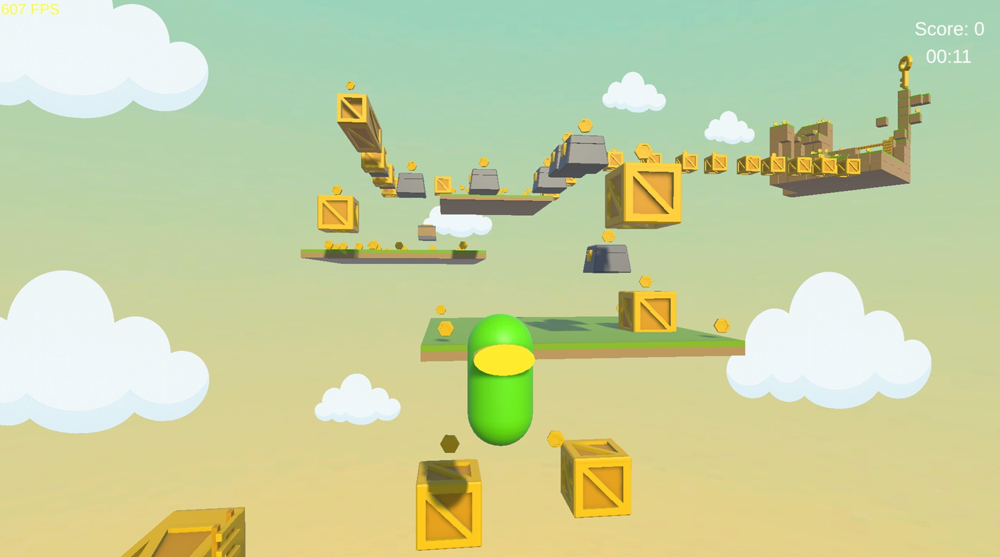

# 3D Cross-Platform Platformer Game  
**Unity · Windows · Nintendo Switch**

A fast-paced **3D platformer** developed by a **3-programmer team**, targeting **Windows** and **Nintendo Switch**.  
This public repository includes all **platform-agnostic Unity gameplay code**, editor tools, UI systems, and **Windows builds**.  

> **Nintendo Switch–specific code and build files are NOT included** due to SDK NDA restrictions.

---
## Jummpers

## Project Overview

This game is a **vertical progression 3D platformer** where players climb upward across dynamic platforms, avoid enemies, gather items, and survive without falling out of view.  
The project focuses on:

- Clean, modular Unity C# architecture  
- Cross-platform structure with Switch abstraction  
- Responsive movement & physics  
- Procedural world elements  
- Clear camera readability  
- Polished UI, VFX, SFX, and feedback systems  

---

##  1. Core Gameplay Programmer  
**Focus: Player movement, physics, collision, and “game feel.”**

- PlayerCharacter architecture  
- Movement (Enhanced Input)  
- Jumping & bounce physics  
- Collision and landing detection  
- Dynamic jump modifiers (platform attributes)  
- Death conditions (falling, enemy hit)  
- Respawn / Restart flow  

---

## 2. World & Interaction Programmer  
**Focus: Platforms, enemies, items, and environmental interactions.**

- Platform classes: Normal / SuperJump / Random  
- Player landing → jump power transfer  
- EnemyBase (Patrol / Chase / Damage / Knockback)  
- Item pickups (score, buffs, temporary boosts)  
- PlatformSpawner (procedural generation)  
- Object Pooling for performance  

---

## 3. Camera, UI & Feedback Programmer  
**Focus: readability, camera systems, HUD, warnings, and feedback.**

- CameraFollow with soft zones and vertical lead  
- Out-of-view detection + Warning indicator  
- Game Over flow  
- HUD (Score, Combo, Life)  
- GameStateManager (Menu/Playing/GameOver)  
- VFX/SFX triggers  
- Debug overlay (camera bounds, jump force, FPS, etc.)  

---

# Core Gameplay Features

### ✔️ Responsive movement & jump physics  
### ✔️ Dynamic platforms with unique effects  
### ✔️ Score, combo, life, and state systems  
### ✔️ Out-of-view warning system  
### ✔️ Game Over → Retry loop  
### ✔️ VFX/SFX-based feedback  

---

# Nintendo Switch Policy

Switch development requires access to private SDK tools and restricted documentation.  

### Allowed in this repo:
- General Unity gameplay code  
- Windows builds

